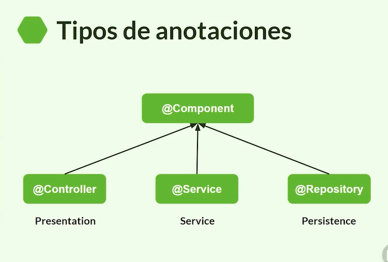

# Getting Started

###Dependencia

¿Qué es una dependencia?

Pequeña característica de un objeto especifico, que puede impactar de manera particular en el funcionamiento de una unidad.
Por ejemplo, las dependencias de un Smartphone serian:

    Cámara
    Micrófono
    Pantalla
    Batería

Alta cohesión: Involucra que la entidad ejecute sus acciones sin involucrar otra clase o entidad.

Bajo acoplamiento Hablamos de acoplamiento bajo cuando existe una independencia entre los componentes entre si, por el contrario un alto acoplamiento es cuando tenemos varias dependencias relacionadas a un solo componente.

Entonces podemos afirmar que en la definición de un buen diseño de software se debe tener una ALTA COHESIÓN y un BAJO ACOPLAMIENTO.

    Inversion de control IoC
        Se refiere a la transferencia del control del flujo de un programa a un contenedor o framework.
            En un website o una app móvil el contenedor sería el usuario.
        Ventajas
            Facil testing por componentes o mocks de dependencias.
            Mayor modularización.
            Desacoplamiento cuando lo objetos cuentan con sus dependencias.
            Segmentación de interfaces.
        IoC en el contexto de spring boot
            Los objetos que son administrados por el contenedor, spring boot los denomina beans. Un bean seria los objetos administrados por el usuario en un website.
            Un bean es un objeto el cual es instanciado, ensamblado y administrado por el contenedor de spring IoC.
    Patron de inyección de dependencias
        Es el patrón que utiliza IoC para utilizar las dependencias anteriormente instanciadas por el contenedor de spring.
Un Bean es una única instancia que se crea al inicio de la ejecución del programa y puede ser usada en otras clases llamándola con @Autowired (aquí le decimos “dependencia”), también se puede llamar en el constructor de la clase y el mismo framework hace la “magia” de ir por ella sin necesidad de nosotros pararle la instancia en el constructor cuando usemos la clase.

TIPOS DE ANOTACIONES

@Controller: Para indicar que esta será la clase que gestionara las peticiones del usuario por get, post, put, patch o delete.

@Service: Con esta notación especificamos que en esta clase se encontrara toda nuestra lógica de negocio, cálculos o llamadas a otras API externas.

@Repository: Se usa para las clases o interfaces que funcionaran con el acceso a la base de datos.

Si nuestra clase o interfaz no tiene una especificación clara como @Service, @Repository o @Controller, simplemente recurrimos a @Component y le indicamos que sencillamente es un componente.

Por otro lado, no es estrictamente necesario que cumplas con colocar una notación especifica, pero es una buena practica.